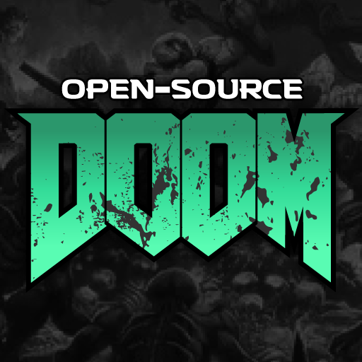

<p align="center">
  
</p>

<h1 align="center">Open Source DOOM</h1>

<p align="center">
  <strong>Real-time P2P multiplayer DOOM. No servers required.</strong><br>
  A 4.2MB file in a chat message. Open it. Frag your friends.
</p>

<p align="center">
  <a href="https://vectorapp.io/blog/open-source-doom/">Blog Post</a> &middot;
  <a href="https://vectorapp.io">Download Vector</a> &middot;
  <a href="https://github.com/JSKitty/VectorDoom/releases">Releases</a>
</p>

---

## What is this?

Open Source DOOM is a fork of [Cloudflare's doom-wasm](https://github.com/cloudflare/doom-wasm) (Chocolate Doom compiled to WebAssembly) with the entire networking stack rebuilt from scratch for **real-time, decentralised, peer-to-peer multiplayer** over [WebXDC](https://webxdc.org/) realtime channels.

It ships as a `.xdc` file - a tiny zip archive you send in a chat message. No servers, no accounts, no app stores. Your friend opens it, and you're playing DOOM together.

## What changed from Cloudflare's version?

| | Cloudflare | Open Source DOOM |
|---|---|---|
| **Transport** | WebSockets via Cloudflare Edge | P2P gossip via [Iroh](https://iroh.computer/) (QUIC) |
| **Server** | Durable Object (centralised) | Auto-elected from players |
| **Sync model** | Lockstep (1993 original) | Real-time hybrid (snapshots + interpolation) |
| **Damage** | Simulated locally by all clients | Host-authoritative events |
| **NPCs** | Simulated locally by all clients | Host-authoritative snapshots |
| **Late join** | Not supported | Fully supported |
| **Internet** | Required (Cloudflare Workers) | Not required (P2P) |
| **Delivery** | Website | 4.2MB chat message |

For the full technical deep-dive, read the [blog post](https://vectorapp.io/blog/open-source-doom/).

## Key features

- **No servers** - Magic-byte server election picks a host automatically in ~3 seconds
- **Real-time gameplay** - Position snapshots every 57ms with exponential smoothing interpolation
- **Host authority** - Health, damage, NPCs, USE events, and respawns are host-authoritative
- **NPC synchronisation** - Monsters are simulated only on the host, snapshots drive all clients
- **Mid-game joining** - Drop in anytime with tic synchronisation
- **Mobile touch controls** - Dual joysticks, action buttons, weapon cycling
- **Gamepad support** - Web Gamepad API with analog sticks, triggers, and d-pad
- **Co-op and Deathmatch** - Both game modes supported
- **4.2MB total** - Engine + shareware WAD + UI, compressed with `zip -9`

## Play it

The easiest way to play is through [Vector](https://vectorapp.io):

1. Open Vector
2. Go to **Vector Nexus** (the in-app Mini App store)
3. Find **DOOM** in the Multiplayer category
4. Send it to a friend or group chat
5. Both open it - game on

It also works in [Delta Chat](https://delta.chat/) and any other WebXDC-compatible messenger.

## Build from source

### Prerequisites

- [Emscripten SDK](https://emscripten.org/docs/getting_started/downloads.html) (tested with 5.0.2)
- autotools (`automake`, `autoconf`)
- SDL2 libraries

### Compile

```bash
# Set up emsdk
cd /tmp && git clone https://github.com/emscripten-core/emsdk.git
cd emsdk && ./emsdk install 5.0.2 && ./emsdk activate 5.0.2

# Configure
export PATH="/tmp/emsdk:/tmp/emsdk/upstream/emscripten:$PATH"
emconfigure autoreconf -fiv
ac_cv_exeext=".html" emconfigure ./configure --host=none-none-none
emmake make -j4
```

### Package as .xdc

```bash
# Requires doom1.wad (shareware) in src/
./build-xdc.sh
# Output: vectordoom.xdc (~4.2MB)
```

## Architecture

```
index.html          UI, touch controls, gamepad, CRT theme
webxdc-net.js       Server election + packet routing (--pre-js)
vector-doom.wasm    Chocolate Doom engine (Emscripten)
  net_webxdc.c        WebXDC transport module
  d_net.c             Snapshot interpolation, health/damage authority
  p_netsync.c/h       NPC net ID registry + snapshot sync
  net_client.c        Custom packet sending (damage, USE, respawn, chat)
  net_server.c        Custom packet routing + late join handling
  i_input.c           JS input injection (inject_key_event, inject_mouse_motion)
```

See [CLAUDE.md](CLAUDE.md) for the full technical reference and [NETCODE_ARCHITECTURE.md](NETCODE_ARCHITECTURE.md) for the deep-dive on tic synchronisation.

## Credits

- **[id Software](https://www.idsoftware.com/)** - Open-sourcing the DOOM engine (1997)
- **[Chocolate Doom](https://www.chocolate-doom.org/)** - Faithful portable DOOM recreation
- **[Cloudflare](https://github.com/cloudflare/doom-wasm)** - doom-wasm port (the foundation we forked)
- **[Emscripten](https://emscripten.org/)** - C to WebAssembly compiler
- **[Iroh](https://iroh.computer/)** - QUIC-based P2P gossip protocol
- **[WebXDC](https://webxdc.org/)** - Open standard for sandboxed chat apps

## License

GNU GPL-2.0 (inherited from Chocolate Doom / id Software)
